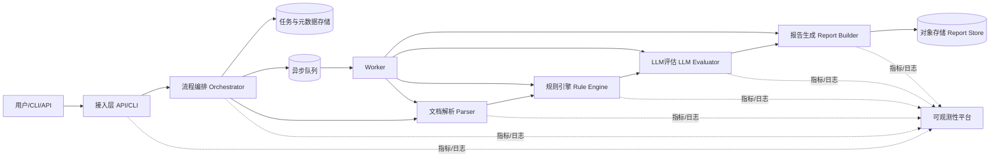
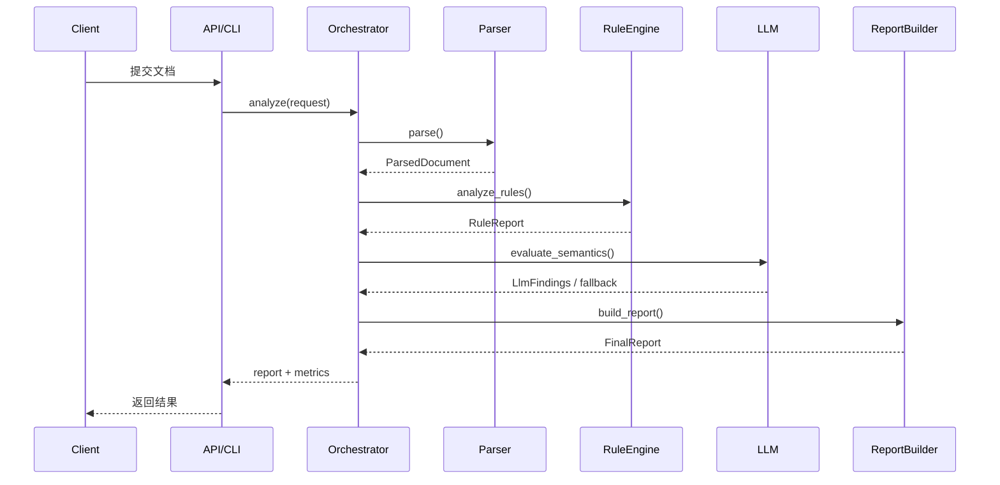
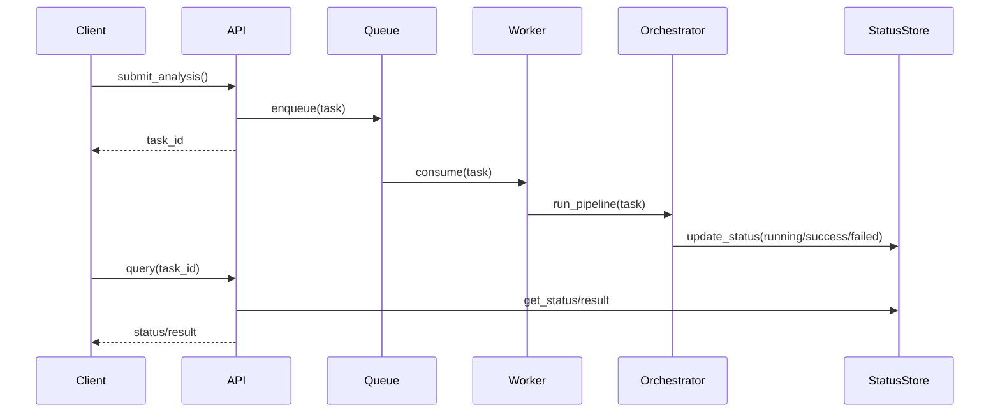
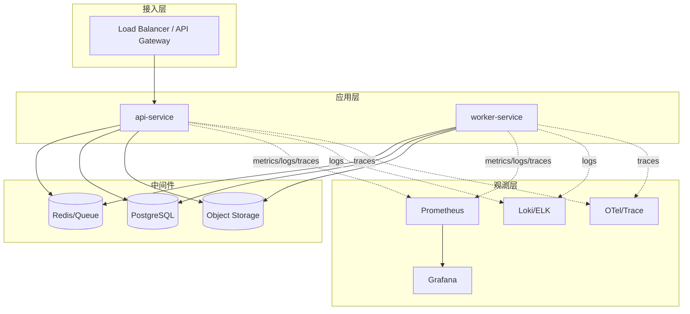

# PRDsAgent 架构设计文档（M1）

## 1. 文档信息
- 文档版本：v1.0
- 创建日期：2026-03-05
- 适用阶段：M1（技术验证与评测基线）
- 参考文档：
  - `docs/项目愿景.md`
  - `openspec/changes/add-m1-week2-week3-task-plan/proposal.md`
  - `departments/角色分配总览.md`

## 2. 设计目标与约束
### 2.1 目标
系统采用流水线分层架构，实现 `文档解析 -> 规则检查 -> LLM评估 -> 报告生成` 的端到端闭环，服务需求评审提效与质量提升。

### 2.2 M1 硬约束（Gate）
- PoC 准确率：`>= 80%`
- 同步接口 P95：`<= 6s`
- 成功率：`>= 99%`
- 5xx 率：`<= 0.5%`
- 超时率：`<= 0.5%`

### 2.3 范围边界
- In-Scope：Markdown/TXT/DOCX 解析、规则检测、基础 LLM 语义评估、结构化报告输出。
- Out-of-Scope：自动生成完整 PRD、深度双向工作流改造、复杂创新推理、多语言扩展。

## 3. 整体架构图

## 4. 核心组件说明
| 组件 | 责任 | 输入 | 输出 | 当前状态 |
|---|---|---|---|---|
| 接入层（CLI/API） | 接收请求、参数校验、结果返回 | 文件路径/文件内容、配置 | 同步结果或任务ID | CLI已存在，API待补充 |
| Orchestrator | 编排同步/异步流程、状态机、错误收敛 | 分析请求 | 分阶段执行结果、任务状态 | 规划中 |
| Document Parser | 多格式解析为统一结构 | Markdown/TXT/DOCX | ParsedDocument | 已有基础实现 |
| Rule Engine | 确定性规则检测 | ParsedDocument | RuleReport + issues | 已有基础实现 |
| LLM Evaluator | 语义补充评估与建议 | ParsedDocument + RuleReport | LlmFindings | 规划中（M1可先Mock） |
| Report Builder | 聚合并输出报告 | RuleFindings + LlmFindings | JSON/Markdown报告 | 规划中 |
| Queue + Worker | 异步任务处理、重试、超时 | Task payload | 任务结果/失败事件 | 规划中 |
| Observability | 指标、日志、追踪、告警 | 全链路遥测数据 | 仪表盘/告警事件 | 规划中 |

## 5. 详细模块设计
## 5.1 文档解析模块（Document Parser）
### 职责
- 支持 `md/txt/docx` 三种输入。
- 输出统一数据结构：`source_path/content/sections/metadata`。

### 输入/输出契约
- 输入：`file_path` 或 `file_bytes + mime`
- 输出：`ParsedDocument`
  - `sections[]`: `title`, `level`, `content`
  - `metadata`: `format`, `encoding`, `parse_warnings`

### 关键设计
- 编码回退策略：`utf-8 -> gb18030 -> ignore errors`
- Markdown 按标题层级分段。
- DOCX 按标题样式识别章节。
- 未支持格式返回结构化错误码：`PARSE_UNSUPPORTED_TYPE`。

### 风险与控制
- 风险：编码污染导致规则误判。
- 控制：加入编码探测结果和解析警告字段；增加编码回归样本。

## 5.2 规则引擎模块（Rule Engine）
### 职责
- 对需求文档执行确定性质量检查，提供可复现结果。

### 规则域（M1）
- 完整性检查（目标/范围/依赖/验收标准）
- 验收标准检查（是否存在、是否量化）
- 数值冲突检测（上下界冲突）
- 模糊词检测（不可测描述）

### 输入/输出契约
- 输入：`ParsedDocument`
- 输出：`RuleReport`
  - issue 字段：`rule_id/category/severity/message/suggestion/evidence/line_no`

### 关键设计
- 规则插件化（后续）：`Rule.check(doc) -> list[Issue]`
- 规则参数和词典配置化（避免硬编码）。
- 每条规则可追溯到章节和原文片段。

## 5.3 LLM评估模块（LLM Evaluator）
### 职责
- 在规则引擎之上补充语义层评估，不替代规则兜底。

### 评估范围（M1）
- 术语一致性
- 语义冲突提示
- 验收标准可测试性改写建议

### 输入/输出契约
- 输入：`ParsedDocument + RuleReport + EvalConfig`
- 输出：`LlmFindings`
  - 字段建议：`model_id/prompt_version/confidence/fallback_used/latency_ms/token_usage`

### 关键设计
- 模型网关（Model Gateway）负责：路由、超时、重试、熔断、降级。
- LLM失败时降级为“仅规则结果”，并标记 `fallback_used=true`。
- M1可先落地 MockAdapter 跑通链路，M2接入真实模型。

## 5.4 报告生成模块（Report Builder）
### 职责
- 聚合规则与LLM结果，输出可执行的审查报告。

### 输出格式
- 机器可读：`JSON`（主真源）
- 人类可读：`Markdown`（派生视图）

### 报告最小字段（M1）
- `request_id`
- `summary`：error/warning/info 数量、风险等级
- `findings[]`：问题类型、严重级、证据定位、修复建议
- `metrics`：阶段耗时分解
- `versions`：rule/model/prompt 版本

### 关键设计
- JSON 与 Markdown 结论一致性校验。
- 报告脱敏处理（PII与密钥模式）。

## 6. 数据流设计
## 6.1 同步链路

## 6.2 异步链路

## 7. 部署架构设计
## 7.1 环境分层
- `local`：开发与单元测试
- `dev`：共享联调
- `staging`：性能回归与Gate评审
- `prod`：生产服务

## 7.2 部署拓扑图

## 7.3 CI/CD 策略
- CI：lint + test + security scan + build。
- CD：
  - `develop -> dev` 自动部署
  - `release/* -> staging` 自动部署与回归
  - `main -> prod` 审批后金丝雀发布
- 自动回滚触发：5xx、P95、队列积压超阈值。

## 8. 性能指标与容量规划
## 8.1 指标定义（M1）
| 指标 | 目标值 | 说明 |
|---|---|---|
| PoC准确率 | `>=80%` | 基于 `dataset-m1-v1` |
| 同步接口P95 | `<=6s` | 500请求、20并发、10分钟 |
| 成功率 | `>=99%` | 与5xx/超时联动 |
| 5xx率 | `<=0.5%` | 三轮最差值判定 |
| 超时率 | `<=0.5%` | 三轮最差值判定 |

## 8.2 容量建议（M1起步）
- `api-service`: 2副本（2C4G）
- `worker-service`: 3副本（4C8G）
- Redis：开启持久化
- PostgreSQL：单主+定时备份（M2升级HA）

## 8.3 扩缩容策略
- `queue_depth > 300` 持续10分钟：worker +1
- `cpu > 70%` 且 `p95`超目标：api +1

## 9. 安全设计
## 9.1 身份与权限
- 统一认证（SSO/OIDC）
- RBAC 最小权限（项目/文档粒度）
- 服务账号按模块拆分权限

## 9.2 数据安全
- 传输加密：TLS
- 存储加密：数据库与对象存储加密
- 敏感字段脱敏后入日志与评测集
- 文档内容访问全链路审计

## 9.3 密钥与配置
- 密钥使用 Vault/KMS 管理
- 禁止密钥入库和写入镜像
- 密钥轮换策略：高敏感30天，普通90天

## 9.4 安全门禁
- 任一 RBAC/审计/脱敏控制失败，Gate 直接 `No-Go`。

## 10. 监控与告警方案
## 10.1 监控指标
- API：请求量、P95/P99、5xx
- 任务：队列深度、等待时长、任务成功率
- 模块：解析成功率、规则耗时、LLM耗时/失败率、报告生成耗时
- 资源：CPU/内存/磁盘/容器重启

## 10.2 告警分级
### P1（5分钟内响应）
- API可用性低于阈值
- 5xx持续高位
- 队列持续积压
- LLM不可用且降级失效

### P2（30分钟内处理）
- P95时延持续超阈值
- 异步任务时长持续超阈值
- 解析失败率异常升高

### P3（工作时段处理）
- 资源水位过高
- 日志采集延迟

## 10.3 SLO（M1）
- API可用性：`>=99.5%`
- API时延：目标 `P95<=3s`，Gate底线 `P95<=6s`
- 异步任务：99% 在60秒内完成
- 任务成功率：`>=98%`

## 11. 子 Agent 会议结论（基于角色分配总览）
## 11.1 参会角色
- 产品经理：陈思远（产品管理部）
- 技术负责人/架构师：李承泽（技术架构部）
- 开发工程师：王浩然（软件开发部）
- 测试工程师：赵雨桐（质量保障部）
- DevOps工程师：孙嘉宁（运维平台部）
- 项目经理：周明远（项目管理部）

## 11.2 统一决议
- M1 先完成最小闭环：解析/规则/LLM(可Mock)/报告全链路打通。
- 采用“规则兜底 + LLM增强”双层策略，保障可解释性与稳定性。
- 先冻结输入输出契约与错误码，再扩展组件能力。
- 以测试可复现和指标可测为先决条件，避免“功能可跑但不可验收”。
- 发布采用金丝雀+自动回滚，Gate前完成回滚演练。

## 11.3 M1 现在做
- Parser v1、Rule Engine v1、Orchestrator 同步模式
- 报告 JSON/Markdown 双输出
- 基础监控告警、错误码体系、回归基线

## 11.4 M2/M3 再做
- 真实多模型路由与高级策略
- 深度外部系统双向同步
- 多租户与更细粒度权限
- 反馈学习闭环与更强语义推理

## 12. 风险与缓解
| 风险 | 影响 | 缓解措施 | Owner |
|---|---|---|---|
| 编码污染导致误判 | 准确率下降 | 编码探测+回归样本+解析告警 | 开发/QA |
| LLM波动或不可用 | 结果不稳定 | 超时/熔断/降级到规则结果 | Tech Lead/DevOps |
| 指标口径不一致 | Gate争议 | 固化数据集、压测协议、三轮最差值规则 | QA/PM |
| 发布风险 | 线上不稳定 | 金丝雀发布、阈值回滚、演练留痕 | DevOps |

## 13. 开放问题
- LLM供应商路线（云API/私有化）最终选型。
- 异步任务中间件（Celery/RQ）M2具体落地方案。
- API 服务化对外契约版本（仅CLI还是REST API）。
