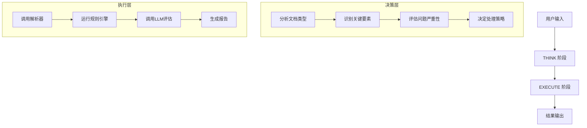

# PRDsAgent Think-Execute 架构设计文档

## 1. 文档信息
- 文档版本：v1.0
- 创建日期：2026-03-05
- 适用阶段：M1（技术验证与评测基线）
- 参考文档：
  - `docs/architecture-design.md`
  - `docs/status/subagent-architecture-design-review-2026-03-05.md`
  - 六角色会议讨论结果

## 2. 设计目标
### 2.1 核心目标
PRDsAgent 采用 Think-Execute 循环机制，实现智能决策与确定性执行的分离，确保：
- **可解释性**：每个决策都有明确的思考过程
- **稳定性**：执行层基于确定性规则，避免LLM随机性
- **可维护性**：Think和Execute模块可独立演进
- **可测试性**：执行结果可复现和验证

### 2.2 适用场景
- 需求文档质量分析
- 多维度规则检查
- LLM增强评估
- 结构化报告生成

## 3. 整体架构图


## 4. THINK 阶段详细设计
### 4.1 输入分析
- **文档格式识别**：判断输入是 Markdown/TXT/DOCX
- **内容结构分析**：识别章节、标题、列表等结构
- **关键要素提取**：目标、范围、依赖、验收标准等

### 4.2 策略决策
- **处理模式选择**：同步 vs 异步
- **规则集选择**：根据文档类型选择适用规则
- **LLM调用决策**：基于规则检查结果决定是否需要LLM深度分析
- **降级策略**：LLM不可用时的fallback方案

### 4.3 输出契约
THINK 阶段输出执行计划：
```json
{
  "execution_plan": {
    "parser_type": "markdown",
    "rule_sets": ["completeness", "acceptance_criteria", "fuzzy_terms"],
    "llm_required": true,
    "timeout_seconds": 30,
    "fallback_strategy": "rules_only"
  }
}
```

## 5. EXECUTE 阶段详细设计
### 5.1 文档解析
- **输入**：原始文档文件
- **输出**：标准化的 ParsedDocument 对象
- **错误处理**：格式不支持、编码问题、解析失败

### 5.2 规则检查
- **输入**：ParsedDocument + 规则集配置
- **输出**：RuleReport（包含所有发现问题）
- **执行顺序**：完整性 → 冲突检测 → 模糊词检测 → 验收标准

### 5.3 LLM评估
- **输入**：ParsedDocument + RuleReport + 评估配置
- **输出**：LlmFindings（语义层面的补充建议）
- **降级机制**：LLM超时或失败时返回空结果并标记

### 5.4 报告生成
- **输入**：RuleReport + LlmFindings
- **输出**：JSON/Markdown 格式的结构化报告
- **一致性保证**：JSON和Markdown结论必须一致

## 6. 错误处理与降级
### 6.1 错误分类
- **解析错误**：文档格式不支持、编码问题
- **规则错误**：规则执行异常、配置错误
- **LLM错误**：超时、服务不可用、响应格式错误
- **系统错误**：内存不足、磁盘空间不足

### 6.2 降级策略
| 错误类型 | 降级策略 | 用户影响 |
|---------|----------|----------|
| 解析错误 | 返回格式错误 | 高 |
| 规则错误 | 跳过该规则，继续执行其他规则 | 中 |
| LLM错误 | 仅返回规则结果，标记LLM不可用 | 低 |
| 系统错误 | 返回系统错误，建议重试 | 高 |

## 7. 性能与监控
### 7.1 性能指标
- **THINK阶段**：<100ms
- **解析阶段**：<1s（1MB文档）
- **规则检查**：<500ms
- **LLM评估**：<30s（P95）
- **报告生成**：<100ms

### 7.2 监控指标
- THINK决策时间分布
- 各执行阶段成功率
- LLM调用成功率和延迟
- 降级触发次数和原因

## 8. 六角色评审结论
基于六角色会议讨论，达成以下共识：

### 8.1 统一决议
- 采用 **"规则兜底 + LLM增强"** 的双层策略
- THINK阶段必须输出完整的执行计划，便于调试和审计
- EXECUTE阶段各模块必须有完善的错误处理和降级机制
- 所有输出必须可复现，避免LLM随机性影响

### 8.2 各角色关注点
- **产品经理**：确保验收标准量化，避免模糊描述
- **技术负责人**：架构扩展性，支持未来多模型路由
- **开发工程师**：实现复杂度可控，模块解耦
- **测试工程师**：各阶段输出可测试，错误场景覆盖完整
- **运维工程师**：监控指标完备，降级策略可靠
- **项目经理**：开发周期合理，风险可控

## 9. 实施计划
### 9.1 M1阶段（当前）
- 实现基础THINK-EXECUTE框架
- 完成文档解析和规则引擎集成
- LLM评估使用Mock实现
- 基础监控和错误处理

### 9.2 M2阶段（后续）
- 接入真实LLM服务
- 实现多模型路由和高级策略
- 完善监控告警体系
- 支持异步处理模式

## 10. 风险与缓解
| 风险 | 影响 | 缓解措施 | Owner |
|------|------|----------|-------|
| THINK决策逻辑复杂 | 维护困难 | 保持决策逻辑简单，复杂逻辑移到规则引擎 | Tech Lead |
| LLM结果不稳定 | 用户体验差 | 严格的降级机制，规则结果作为兜底 | Dev/QA |
| 性能不达标 | Gate失败 | 提前性能压测，优化关键路径 | DevOps |
| 错误处理不完善 | 系统崩溃 | 完整的异常处理，单元测试覆盖 | Dev/QA |